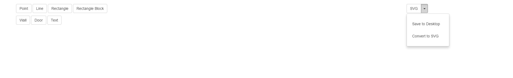
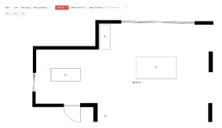

# Convert Drawing Project

The convert drawing project uses:

- PHP Session API

- PHP Error Handlers

- PHP Filter Vars / Sanitization Techniques

- Apache

## Convert Drawing App 

The Convert Drawing App demnonstrates several of the drawings generated:

Interface of the prototype app:

Screenshot of the print mode:

Screenshot of the app with drawing assists:

Screenshot of an medium sized open space:

Screenshot of an open space, alternatively a Design Layout:

Screenshot of an overall plan:

## Design of a Font

A font was developed during the construction of the project. The font developed is custom, copied from existing hand written characters. The font was developed in FontForge.

